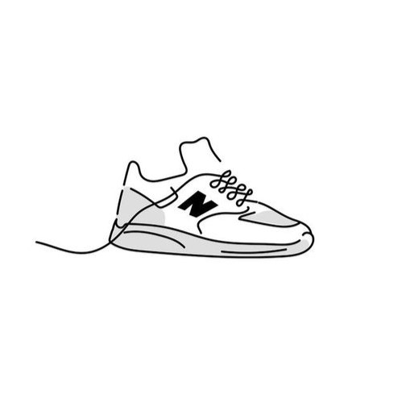
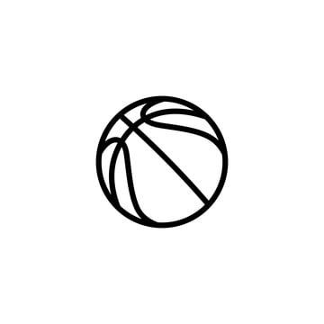

  <h1>	Spesifikasi Kebutuhan Perangkat Lunak</h1>
  <h1>	SneakyKicks </h1>
  <h2>	Versi 1.0 disetujui </h2>
  <h2>	Disiapkan oleh :</h2>

  
	Fahreza Azi Prayodha (22091397042) 

  
	Mohamad Dhil Annafi (22091397056) 

  
	M. Sultonun Naim (22091397065)

	02/10/2023 

## Daftar Isi

- [1.Pendahuluan](#1-Pendahuluan)

- [2. Deskripsi keseluruhan](#2-Deskripsi-keseluruhan)

- [3. Antarmuka](#3-Antarmuka)

- [4. Fitur Sistem](#4-Fitur-Sistem)

  

 ## 1. Pendahuluan

 

 **1.1 Tujuan**

Tujuan dari SRS ini adalah untuk menjelaskan spesifikasi kebutuhan yang diperlukan dalam pengembangan website review sepatu. Penjabaran spesifikasi website ini meliputi deskripsi umum dari platform tersebut serta deskripsi lengkap mengenai kebutuhan yang harus dipenuhi dalam pembuatan website review sepatu ini. SRS website review sepatu ini disusun dalam rangka tugas dari mata kuliah Pemrograman Web. Dengan adanya spesifikasi kebutuhan ini, diharapkan website review sepatu dapat dikembangkan sesuai dengan standar yang telah ditentukan.

**1.2	 Konvensi Dokumen**

Standar dalam menulis SRS ini seperti: 
Font
Font yang digunakan dalam penulisan SRS ini menggunakan Times New Roman dengan ukuran 12 untuk isi.Kemudian untuk Judul menggunakan font arial dengan ukuran 32 dan 14.lalu, bab menggunakan Times New Roman dengan ukuran 14 dan Sub bab menggunakan font Times New Roman dengan ukuran 14
Penyorotan
Pada penulisan SRS ini penyorotan tebal (Bold) digunakan pada saat menulis Bab, Sub-Bab atau Judul.Kemudian penulisan miring (italic) digunakan pada saat penulisan kata asing.
Penomoran
Untuk memudahkan referensi dan perorganisasian dalam penulisan SRS digunakanlah penomoran.Penomoran yang digunakan pada SRS ini menggunakan angka ,seperti 1.1,2.1 dan 3.1

**1.3	Audiens yang Dituju dan Saran Bacaan**

Website review sepatu ini ditujukan untuk semua kalangan yang ingin mendapatkan informasi lebih lanjut tentang berbagai jenis sepatu yang ada di pasaran. Kami mengundang pembaca dari berbagai latar belakang dan usia, termasuk pecinta sepatu, pemburu gaya, atlet, dan siapa pun yang tertarik untuk mengeksplorasi dunia sepatu. Selain itu, kami juga berharap bahwa website ini dapat menjadi sumber inspirasi dan panduan bagi individu yang mencari ulasan dan rekomendasi sepatu. Kami berharap bahwa website ini dapat memberikan wawasan yang lebih dalam tentang berbagai merek, model, dan performa sepatu yang kami tinjau, membantu para pembaca membuat keputusan yang lebih baik dalam memilih sepatu yang sesuai dengan kebutuhan.

**1.4	Lingkup Produk**

Website review sepatu merupakan platform yang fokus pada ulasan berbagai jenis sepatu. Website ini menyajikan informasi terperinci mengenai berbagai merek sepatu, model, dan performa. Selain itu, website ini juga memberikan pandangan mendalam mengenai pengalaman pengguna dengan mencantumkan nama pengulas, penilaian, dan komentar. Hal ini bertujuan untuk membantu pembaca dalam membuat keputusan yang informasional dan cerdas saat memilih sepatu yang sesuai dengan kebutuhan mereka.

	
## 2. Deskripsi keseluruhan

**2.1	Perspektif Produk**

Website review sepatu adalah platform yang menyajikan ulasan tentang berbagai sepatu yang ada di pasaran. Situs ini memberikan informasi mendalam mengenai sejumlah merek sepatu populer dan model. Pengguna dapat menemukan performa, dan desain. Website ini juga menyertakan ulasan, mencakup aspek-aspek seperti kenyamanan, daya tahan, dan gaya. Selain itu, informasi tentang tempat pembelian, dan harga juga dapat ditemukan di halaman website ini. Semua ulasan bertujuan untuk memberikan panduan yang akurat kepada pembaca dalam membuat keputusan yang cerdas saat memilih sepatu sesuai dengan kebutuhan mereka.
 
**2.2	Fungsi Produk**

●Informasi Terpercaya: Pengguna dapat mengakses ulasan dan penilaian produk sepatu dari pengguna lain, memberikan informasi yang dapat dipercaya untuk membantu dalam pengambilan keputusan pembelian.

●Pembandingan Produk: Website review sepatu memungkinkan pengguna untuk membandingkan berbagai merek, model, dan jenis sepatu secara mudah, membantu mereka menemukan produk yang paling sesuai dengan kebutuhan mereka.

●Peningkatan Keputusan Pembelian: Dengan informasi yang lebih baik tentang sepatu yang mereka cari, pengguna dapat membuat keputusan pembelian yang lebih baik sesuai dengan preferensi dan kebutuhan mereka.

●Kemudahan Berbelanja Online: Dengan menyediakan informasi yang lengkap tentang sepatu, situs ini mempermudah pengguna untuk berbelanja sepatu secara online tanpa harus pergi ke toko fisik.

●Meningkatkan Kepercayaan: Produk website review sepatu yang andal dan terpercaya dapat membantu meningkatkan kepercayaan konsumen terhadap merek atau toko yang disebutkan dalam ulasan.

●Dukungan Keputusan yang Objektif: Dengan adanya ulasan dari berbagai pengguna, pembeli dapat mendekati keputusan pembelian mereka dengan perspektif yang lebih objektif.

●Mengurangi Resiko Pembelian: Ulasan dan penilaian produk membantu mengurangi risiko pembelian yang kurang berhasil atau kecewa dengan produk sepatu yang dibeli.

●Peningkatan Kualitas Produk: Ulasan dan umpan balik konsumen dapat membantu produsen sepatu untuk memahami kebutuhan pelanggan dan terus meningkatkan kualitas produk mereka.

**2.3	Kelas dan Karakteristik Pengguna**

Tabel Karakteristik Pengguna : 

| Kategori Pengguna             | Tugas          | Hak Akses Ke Aplikasi       |
|-------------------------------|----------------|-----------------------------|
|Pengguna|Menjelajahi website|Dapat meriview sepatu yang di inginkan oleh pengguna|
|Pembuat|Mengedit serta menjelajahi website|Dapat melihat serta merubah data maupun tampilan website|

**2.4	Asumsi dan Ketergantungan**

●Website ini harus tersambung dengan koneksi internet dikarenakan berbasis online.

●Website ini dapat di akses dimana saja dengan smartphone, laptop, atau komputer.

●Aplikasi ini membutuhkan pengalaman menggunakan sepatu tersebut dikarenakan website ini berdasarkan pengalaman dari sang reviewer.

**2.5	Lingkungan operasi**

•	Website ini dapat dibuka dari semua browser.

## 3. Antarmuka
	

**3.1	Antarmuka pengguna**

Di halaman awal ini pengguna dapat melihat kategori sepatu (Lifestyle, Basket, Bola, Running), Beranda, Tentang Kami, Bantuan. Pengguna dapat memilih kategori sepatu mana yang ingin di lihat reviewnya.

Di halaman ini pengguna dapat memilih sepatu yang telah di sediakan untuk di lihat reviewnya seperti yang terlihat di gambar atas.

Di halaman selanjutnya akan muncul sepatu yang telah pengguna pilih dan pengguna dapat melihat merk sepatu, nama sepatu, harga sepatu, dan juga review sepatu tersebut.

pada bagian about us terdapat penjelasan tentang website ini,selain itu juga terdapat alamat,email dan nomer telepon.

pada bagian ini pengguna jika mengalami kendala dapat melihat bagian bantuan yang berisikan penjelasan dan juga nomer admin apabila dibutuhkan

	
## 4. Fitur Sistem

**4.1	Deskripsi dan prioritas**

●Halaman Beranda

Halaman ini adalah halaman utama dari website SneakyKicks. Dalam halaman ini pengguna dapat melihat berbagai kategori dan fitur yang tersedia.

●Halaman Kategori

Pada halaman ini pengguna dapat memilih sepatu yang tersedia untuk di lihat reviewnya.

●Halaman detail sepatu

Halaman ini pengguna dapat melihat review sepatu yang telah di pilih oleh pengguna.

**4.2 Lampiran A: Model Analisis**

●Use Case

Di dalam Use Case ini terdapat dua aktor yaitu pengunjung dan admin. Pengunjung dalam memasuki website lalu melihat review sepatu yang tersedia. Admin dapat memasuki website serta mengedit tampilan dan isi website.

● flowchart

Program flowchart adalah bagian yang tidak dapat terpisahkan dengan pembuatan sebuah website. Flowchart ini menjelaskan Langkah-langkah penggunaan dari  website. 
Pembahasan:

a.	Pertama pengguna Masuk kedalam web

b.	Kemudian pilih section

c.	Lalu, memilih jenis sepatu

d.	Memilih sepatu

e.	Selesai.

**Penjelasan:**

-Head

•       <head>: Bagian ini berisi informasi meta dan referensi ke berkas-berkas eksternal yang diperlukan oleh halaman web, seperti file CSS dan ikon favicon.

•       <meta charset="UTF-8">: Mengatur karakter set dokumen sebagai UTF-8, yang merupakan standar internasional yang mendukung banyak karakter dan simbol.

•       <meta name="viewport" content="width=device-width, initial-scale=1.0">: Mengatur viewport untuk responsifitas halaman web pada perangkat berbeda.

•       <link rel="stylesheet" type="text/css" href="css/style.css">: Menghubungkan file CSS eksternal dengan halaman web ini.

•       <title>SneakyKicks</title>: Menentukan judul halaman yang akan ditampilkan pada tab peramban web.

 
&lt;h1&gt;SneakyKicks&lt;/h1&gt; : Menampilkan judul utama halaman web.
&lt;ul&gt; : Ini adalah daftar tak-terurut (unordered list) yang berisi tautan ke halaman "Beranda", "Tentang Kami", dan "Bantuan" yang disusun dalam bentuk daftar dengan &lt;li&gt; (list item).
	
Dengan css:

 
background-color: Menentukan warna latar belakang header, yang dalam hal ini adalah oranye (#FF6B35).
color: Mengatur warna teks dalam header menjadi putih (#EEF4ED).
padding: Memberikan ruang bawah dan atas sebesar 10 piksel dan ruang kanan-kiri nol piksel pada header.
display: Menggunakan flexbox untuk mengatur tata letak header dengan ratakan antara (justify-content: space-between) dan penyejajaran vertikal tengah (align-items: center).
 

 
 
●	header ul li a: Menghilangkan garis bawah (text-decoration: none), memberikan warna putih pada teks (color: #EEF4ED), menerapkan cetakan tebal (font-weight: bold), dan membuat perubahan warna halus saat tautan dihover (transition: color 0.3s).
 
●	header ul li a:hover: Mengubah warna teks tautan menjadi oranye (#ff9900) saat tautan dihover.
 
 

 
1.	Gaya untuk judul utama di dalam header:
   
○	header h1: Menghapus margin atas dan kiri (margin: 0, padding-left: 20px).

2.	Gaya untuk daftar dalam header:

○	header ul: Menghilangkan daftar tak-terurut (list-style: none), mengatur margin dan padding menjadi nol.

○	header ul li: Memberikan margin kanan sebesar 20 piksel pada setiap elemen daftar.

Footer:

  
&lt;div class="footer"&gt; : Ini adalah div yang mengelompokkan konten footer atau bagian bawah halaman web.

●	Di dalam &lt;div class="footer"&gt;, ada informasi kontak seperti alamat, email, dan nomor telepon.

CSS:

  
 
1.	.footer:

○	padding: 25px 0;: Ini mengatur padding (ruang tambahan di dalam elemen) pada bagian atas dan bawah elemen "footer" sebesar 25 piksel, sementara padding horizontalnya (kiri dan kanan) tetap 0, sehingga memberikan ruang di atas dan bawah konten dalam elemen "footer."

○	background-color: #FF6B35;: Menentukan warna latar belakang elemen "footer" menjadi oranye tua (#FF6B35).

○	color: #EEF4ED;: Mengatur warna teks dalam elemen "footer" menjadi putih (#EEF4ED).

○	text-align: center;: Mengatur teks di dalam elemen "footer" menjadi rata tengah secara horizontal.

2.	.footer p:

○	margin-bottom: 10px;: Mengatur margin bawah (ruang tambahan di bawah) dari paragraf dalam elemen "footer" sebesar 10 piksel. Ini membantu memberikan ruang antara paragraf-paragraf di dalam elemen "footer" agar tidak terlalu rapat satu sama lain.
Kategori
 
    

        <h2>Kategori</h2>
        

            

                <a href="lifestyle.html" >
                
                <h3>Lifestyle</h3>
                </a>
            

            

                <a href="basket.html">
                
                <h3>Basket</h3>
                </a>
            

            

                <a href="bola.html">
                
                <h3>Bola</h3>
                </a>
            

            

                <a href="running.html">
                
                <h3>Running</h3>
                </a>
            

        

    

 
&lt;div class="container"&gt; : Ini adalah div (kontainer) yang mengelompokkan konten di dalamnya. Biasanya digunakan untuk mengatur tata letak konten.
&lt;h2&gt;Kategori&lt;/h2&gt; : Menampilkan subjudul "Kategori".
&lt;div class="shoe-category"&gt; : Ini adalah div yang berisi kategori sepatu. Setiap kategori sepatu diwakili oleh elemen .box, yang berisi gambar sepatu, judul kategori, dan tautan ke halaman detail sepatu yang sesuai.

CSS:

1.	.container: Ini adalah aturan gaya untuk elemen dengan kelas "container," yang mengendalikan tampilan konten utama di halaman.

○	max-width: Membatasi lebar elemen "container" menjadi maksimal 1200 piksel.

○	margin: Memberikan margin di atas dan bawah sebesar 25 piksel dan margin horizontal otomatis untuk memusatkan konten.

○	text-align: Mengatur teks di dalam "container" menjadi rata tengah.
  
 
2.	.shoe-category: Ini adalah aturan gaya untuk elemen dengan kelas "shoe-category," yang mengendalikan tampilan kategori sepatu.

○	display: Menggunakan flexbox untuk mengatur tata letak kategori sepatu dengan ruang sekitar yang merata (space-around) dan fleksibilitas perataan baris (flex-wrap: wrap).

○	background-color: Memberikan warna latar belakang kategori sepatu, dalam hal ini adalah biru (#5b7c99).

○	padding: Memberikan ruang sekitar isi kategori sepatu sebesar 20 piksel.

3.	.shoe-category img: Ini adalah aturan gaya untuk gambar di dalam kategori sepatu.

○	width dan height: Mengatur lebar dan tinggi gambar menjadi 300 piksel x 200 piksel.

○	margin: Memberikan margin sekitar gambar sebesar 20 piksel.

○	border: Menambahkan border sebesar 1 piksel dengan warna putih (#EEF4ED).

○	border-radius: Mengubah sudut gambar menjadi melengkung (border-radius: 5px).

○	box-shadow: Menambahkan bayangan pada gambar dengan efek bayangan lembut.

4.	.shoe-category a: Gaya untuk tautan ke halaman detail sepatu dalam kategori sepatu.

○	text-decoration: Menghapus garis bawah dari tautan.

○	color: Memberikan warna teks tautan menjadi abu-abu tua (#333).

5.	.box: Ini adalah aturan gaya untuk elemen dengan kelas "box" di dalam kategori sepatu.

○	display: Mengatur elemen untuk ditampilkan sebagai inline-block.

○	background-color: Memberikan warna latar belakang elemen menjadi putih (#fff).

○	border: Menambahkan border sebesar 1 piksel dengan warna abu-abu muda (#ccc).

○	padding: Memberikan ruang sekitar elemen sebesar 5 piksel.

○	border-radius: Mengubah sudut elemen menjadi melengkung (border-radius: 5px).

○	box-shadow: Menambahkan bayangan pada elemen dengan efek bayangan lembut.
 

List Item:
 
    

        <h2>Kategori Lifestyle</h2>
        

            

                <a href="detail.html">
                    
                    <h3>Sepatu Lifestyle 1</h3>
                </a>
            

            

                <a href="detail-sepatu2.html">
                    
                    <h3>Sepatu Lifestyle 2</h3>
                </a>
            

            <!-- Tambahkan sepatu lainnya dengan tautan ke halaman detail sepatu -->
        

    

&lt;div class="container"&gt; : Ini adalah div (kontainer) yang mengelompokkan konten di dalamnya. Biasanya digunakan untuk mengatur tata letak konten.

●	&lt;h2&gt;Kategori Lifestyle&lt;/h2&gt; : Menampilkan subjudul "Kategori Lifestyle."

●	&lt;div class="shoe-category"&gt; : Ini adalah div yang berisi daftar sepatu kategori Tersebut Setiap sepatu diwakili oleh elemen .shoe-item, yang berisi gambar sepatu, judul sepatu, dan tautan ke halaman detail sepatu yang sesuai.

CSS:

 
1.	.shoe-item: Ini adalah aturan gaya untuk elemen dengan kelas "shoe-item," yang mengendalikan tampilan detail sepatu.

○	width: Mengatur lebar elemen menjadi 300 piksel.

○	margin: Memberikan margin sekitar elemen sebesar 20 piksel.

○	padding: Memberikan padding sebesar 10 piksel.

○	border: Menambahkan border sebesar 1 piksel dengan warna abu-abu muda (#ddd).

○	border-radius: Mengubah sudut elemen menjadi melengkung (border-radius: 5px).

○	box-shadow: Menambahkan bayangan pada elemen dengan efek bayangan lembut.

○	background-color: Memberikan warna latar belakang elemen menjadi putih (#fff).

○	text-align: Mengatur teks di dalam elemen menjadi rata tengah.

○	transition: Menerapkan transisi transformasi saat elemen dihover (transform: scale(1.05)).
  
 
 
 
2.	Gaya untuk tautan ke halaman detail sepatu di dalam elemen "shoe-item":

○	.shoe-item a: Menghapus garis bawah dari tautan.

○	.shoe-item a:hover: Mengubah warna teks tautan menjadi oranye (#ff9900) saat tautan dihover.
 
 
Detail Sepatu:
 
    

        

            

                
            

            

            <h3>New Balance 5740</h3>
            <h4>Rp. 2.300.000</h4>
 
                
Review : 
                   
 
                

 
&lt;div class="box deskripsi"&gt; : Ini adalah div yang digunakan untuk menampilkan deskripsi produk.

●	&lt;h3&gt;New Balance 5740&lt;/h3&gt; : Menampilkan judul produk "New Balance 5740."

●	&lt;h4&gt;Rp. 2.300.000&lt;/h4&gt; : Menampilkan harga produk.

●	&lt;p&gt;Review : ...&gt;/p&lt; : Ini adalah paragraf yang berisi ulasan atau deskripsi produk. Anda dapat menambahkan lebih banyak konten teks atau informasi produk di dalam paragraf ini.

CSS:

1.	.section: Ini adalah aturan gaya untuk elemen dengan kelas "section."

○	padding: Memberikan padding di atas dan bawah sebesar 25 piksel.

2.	.inline-box: Gaya untuk elemen dengan kelas "inline-box."

○	width: Mengatur lebar elemen menjadi 100%.

○	display: Mengatur elemen menjadi inline-block.

○	background-color: Memberikan warna latar belakang elemen menjadi putih.

○	justify-content: Mengatur perataan konten ke tengah (center) secara horizontal.

3.	.gambar: Ini adalah aturan gaya untuk elemen dengan kelas "gambar."

○	width: Mengatur lebar elemen menjadi 30%.

4.	.gambar img: Ini adalah aturan gaya untuk gambar di dalam elemen dengan kelas "gambar."

○	width: Mengatur lebar gambar menjadi 100% dari lebar elemen "gambar" yang mengandungnya.

○	height: Menyesuaikan tinggi gambar agar tetap proporsional.

5.	.deskripsi: Ini adalah aturan gaya untuk elemen dengan kelas "deskripsi."

○	width: Mengatur lebar elemen menjadi 60%.

 

 

<h3>JavaScript</h3>

document.addEventListener("DOMContentLoaded", function() {
    const faqItems = [
    	{
            id: "faq1",
        },
        {
            id: "faq2",
         },
        {
            id: "faq3",
        }
    ];

    const faqLinks = document.querySelectorAll(".faq-link");

    faqLinks.forEach((link) => {
        link.addEventListener("click", (e) => {
            e.preventDefault();
            const faqId = link.getAttribute("data-faq");
            const selectedFaq = faqItems.find((faq) => faq.id === faqId);

            if (selectedFaq) {
                const answerElement = document.querySelector(`#${faqId}-answer`);
                if (answerElement) {
                    if (answerElement.style.display === "none" || answerElement.style.display === "") {
                        answerElement.style.display = "block";
                    } else {
                        answerElement.style.display = "none";
                    }
                }
            }
        });
    });
});

1.	document.addEventListener("DOMContentLoaded", function() { ... });: Ini adalah event listener yang akan menjalankan kode JavaScript ketika dokumen HTML telah selesai dimuat (ketika DOMContentLoaded terpicu).
2.	const faqItems = [...]: Ini adalah array yang berisi objek-objek yang mewakili pertanyaan-pertanyaan FAQ. Setiap objek memiliki properti "id" yang digunakan untuk mengidentifikasi pertanyaan tertentu.
3.	const faqLinks = document.querySelectorAll(".faq-link");: Ini adalah baris kode yang mengambil semua elemen dengan kelas "faq-link" dari dokumen HTML. Ini diasumsikan sebagai tautan atau tombol yang digunakan untuk memunculkan jawaban FAQ.
4.	faqLinks.forEach((link) => { ... });: Ini adalah loop forEach yang akan menjalankan fungsi untuk setiap elemen "faq-link". Ini digunakan untuk menambahkan event listener click pada setiap tautan FAQ.
5.	link.addEventListener("click", (e) => { ... });: Ini adalah event listener yang akan menjalankan kode ketika salah satu tautan FAQ ditekan. Parameter e adalah objek event yang merepresentasikan event klik.
6.	e.preventDefault();: Ini mencegah perilaku default dari event klik (misalnya, mengikuti tautan) sehingga halaman tidak akan terurai.
7.	const faqId = link.getAttribute("data-faq");: Ini mengambil nilai atribut "data-faq" dari tautan FAQ yang ditekan. Atribut ini digunakan untuk mengidentifikasi pertanyaan FAQ yang sesuai.
8.	const selectedFaq = faqItems.find((faq) => faq.id === faqId);: Ini mencari objek FAQ yang cocok dengan faqId dari array faqItems.
9.	if (selectedFaq) { ... }: Ini memeriksa apakah objek FAQ yang cocok ditemukan.
10.	const answerElement = document.querySelector(#${faqId}-answer);: Ini mencari elemen HTML dengan ID yang sesuai dengan pertanyaan FAQ yang ditekan, dengan tambahan "-answer" pada ID.
11.	if (answerElement) { ... }: Ini memeriksa apakah elemen jawaban ditemukan.
12.	Selanjutnya, kode mengubah tampilan elemen jawaban dengan mengatur properti style.display dari "none" menjadi "block" dan sebaliknya. Ini digunakan untuk menampilkan atau menyembunyikan jawaban FAQ saat tautan ditekan.

<h3>HTML</h3>

	

                <a href="#" class="faq-link" data-faq="faq1">Bagaimana cara saya menemukan review sepatu yang tepat?</a>
                    

                        Anda dapat menemukan review sepatu yang sesuai dengan kebutuhan Anda dengan menjelajahi kategori sepatu yang Anda minati. Selain itu, Anda juga dapat memeriksa rating dan komentar dari reviewer.
                    

            

            

                <a href="#" class="faq-link" data-faq="faq2">Apakah review sepatu di situs ini dapat dipercaya?</a>
                    

                        Kami berusaha untuk menyediakan review sepatu yang akurat dan dapat dipercaya. Sebagian besar review berasal dari reviewer yang telah membeli dan mencoba sepatu tersebut. Namun, penting untuk diingat bahwa pengalaman pengguna dapat bervariasi, dan ulasan hanyalah pandangan individu.
                    

            

            

                <a href="#" class="faq-link" data-faq="faq3">Bagaimana cara saya tahu jika sepatu yang saya pilih cocok untuk saya?</a>
                    

                        Untuk menentukan apakah sepatu cocok untuk Anda, perhatikan ulasan, penilaian, dan komentar dari pengguna lain. Anda juga dapat mempertimbangkan faktor seperti ukuran, gaya, dan tujuan penggunaan sepatu. Jika memungkinkan, cobalah sepatu tersebut di toko fisik sebelum membelinya.
                    

            

1.	&lt;div class="faq-bar"&gt; : Ini adalah elemen &lt;div&gt; dengan kelas CSS "faq-bar". Ini digunakan untuk mengelompokkan setiap pasangan tautan FAQ dan jawabannya.
2.	&lt;a href="#" class="faq-link" data-faq="faq1"&gt; Bagaimana cara saya menemukan review sepatu yang tepat? &lt;/a&gt; : Ini adalah tautan (elemen &lt;a&gt;) yang merupakan pertanyaan FAQ. Ini memiliki beberapa atribut:
•	href="#": Ini adalah atribut href yang menentukan tujuan tautan, dalam hal ini, tautan ini akan tidak mengarahkan pengguna ke halaman lain karena nilai "#" digunakan untuk menghindari perubahan URL.

•	class="faq-link": Ini memberikan tautan ini kelas CSS "faq-link", yang mungkin digunakan untuk merancang tampilan tautan secara khusus dengan CSS.

•	data-faq="faq1": Ini adalah atribut data khusus yang digunakan untuk mengidentifikasi pertanyaan FAQ. Nilai atribut ini adalah "faq1" yang sesuai dengan kode JavaScript yang Anda sebutkan sebelumnya.
3.	&lt;div class="faqanswer" id="faq1-answer" style="display: none"&gt; : Ini adalah elemen &lt;div&gt; yang digunakan untuk jawaban FAQ. Ini memiliki beberapa atribut:

•	class="faqanswer": Ini memberikan elemen ini kelas CSS "faqanswer", yang juga dapat digunakan untuk merancang tampilan jawaban dengan CSS.

•	id="faq1-answer": Ini memberikan elemen ini ID unik "faq1-answer", yang digunakan dalam JavaScript untuk mengidentifikasi elemen jawaban yang sesuai dengan pertanyaan tertentu.

•	style="display: none": Ini mengatur elemen jawaban untuk awalnya disembunyikan (tidak terlihat) dengan pengaturan CSS display: none. Ini akan diubah menjadi "block" atau "visible" saat pengguna mengklik pertanyaan FAQ terkait.

<h3>CSS</h3>

.faq-bar {
   text-decoration: none;
    color: #333;
    padding: 20px 0px 20px 0px;
    line-height: 20px;
    display: solid;
    border: 1px solid #dddddd;
    width: auto;
    margin-bottom: -1px;
  }

  .faq-bar a {
    text-decoration: none;
    color: #000000;
    font-weight: bold;
    font-size: 16px;
    transition: color 0.3s;
}

  .faqanswer {
    display: none;
    width: auto;
    background: #e5e5e5;
    padding: 20px;  
    margin-top: 20px;
  }

1.	.faq-bar: Ini adalah selektor CSS yang mengarah pada elemen dengan kelas "faq-bar." Properti CSS yang diterapkan pada elemen ini adalah sebagai berikut:

•text-decoration: none;: Membatalkan dekorasi tautan (misalnya, garis bawah) pada elemen dengan kelas "faq-bar."

•color: #333;: Mengatur warna teks menjadi abu-abu tua (#333).

•padding: 20px 0px 20px 0px;: Mengatur jarak antara konten dan batas elemen, dengan padding atas dan bawah sebesar 20 piksel dan padding sisi kiri-kanan nol.

•line-height: 20px;: Mengatur ketinggian garis teks (line height) menjadi 20 piksel.

•display: solid;: Ini adalah deklarasi yang tidak valid; seharusnya "display: block;" untuk mengubah elemen menjadi elemen kotak blok.

•border: 1px solid #dddddd;: Menambahkan garis batas sebesar 1 piksel dengan warna abu-abu (#dddddd).

•width: auto;: Mengizinkan elemen untuk mengatur lebar secara otomatis sesuai dengan kontennya.

•margin-bottom: -1px;: Mengatur margin bawah sebesar -1 piksel, yang mungkin digunakan untuk menghilangkan jarak antara elemen-elemen yang memiliki kelas "faq-bar."
2.	.faq-bar a: Ini adalah selektor CSS yang mengarah pada tautan yang berada dalam elemen dengan kelas "faq-bar." Properti CSS yang diterapkan pada tautan FAQ adalah sebagai berikut:

•text-decoration: none;: Membatalkan dekorasi tautan pada tautan FAQ.

•color: #000000;: Mengatur warna teks tautan FAQ menjadi hitam (#000000).

•font-weight: bold;: Membuat teks tautan FAQ menjadi tebal (bold).

•font-size: 16px;: Mengatur ukuran teks tautan FAQ menjadi 16 piksel.

•transition: color 0.3s;: Menerapkan transisi warna selama 0.3 detik ketika warna teks tautan berubah, yang bisa memberikan efek perubahan warna yang lembut saat tautan diklik.
4.	.faqanswer: Ini adalah selektor CSS yang mengarah pada elemen dengan kelas "faqanswer," yang digunakan untuk mengatur tampilan jawaban FAQ.
Properti CSS yang diterapkan pada elemen ini adalah sebagai berikut:

•display: none;: Awalnya, elemen jawaban akan disembunyikan dan tidak terlihat.

•width: auto;: Mengizinkan elemen jawaban untuk mengatur lebar secara otomatis sesuai dengan kontennya.

•background: #e5e5e5;: Mengatur warna latar belakang elemen jawaban menjadi abu-abu muda (#e5e5e5).

•padding: 20px;: Memberikan padding sebesar 20 piksel pada elemen jawaban.

•margin-top: 20px;: Menambahkan jarak atas sebesar 20 piksel antara elemen jawaban dan elemen sebelumnya.

 

